# Soulous 代码地图 / Code Walkthrough

这是一份"读代码用"的文档。目标是让你：

1. 看清**功能 ↔ 架构**怎么对上号；
2. 顺着一条业务流程（提交一次学习凭证、跟 AI 聊一次拆解、refresh-token 续签），从前端按钮一路追到数据库；
3. 知道每个核心服务里**哪些代码是自己写的算法**，**哪些是调库**——以及调的是哪个库的哪个 API。

> 所有 Mermaid 图块都能直接在 GitHub / VS Code Markdown Preview / IDEA Markdown 预览里渲染，不需要 Canva。

---

## 0. 一页地图

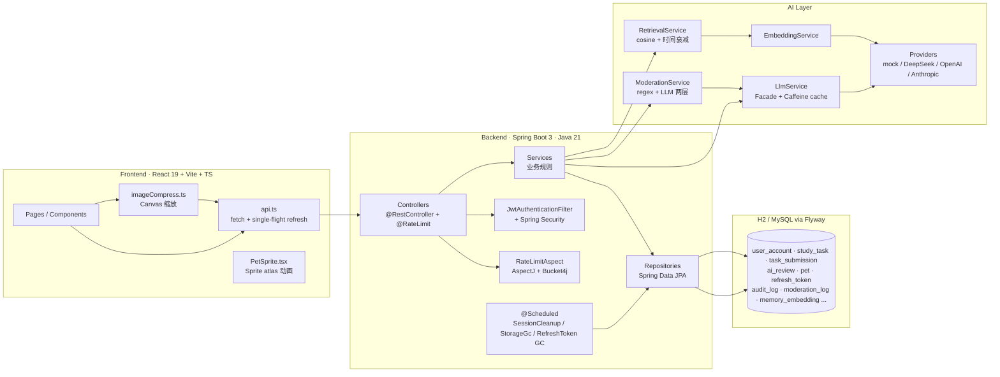

**一句话：** 用户操作 → React 页面调用 `api.ts` → Spring Controller（鉴权 + 限流切面）→ Service（业务规则、AI 决策、宠物成长）→ JPA Repository → DB。AI 全部走 `LlmService` 这层 facade，可以热切 provider。

---

## 1. 目录结构 vs 业务功能映射

| 功能 | 后端包 | 前端入口 | 关键 DB 表 |
| --- | --- | --- | --- |
| 注册 / 登录 / 验证码 / 改密 | [`com.soulous.auth`](../backend/src/main/java/com/soulous/auth) | [`pages/AuthScreen.tsx`](../frontend/src/pages/AuthScreen.tsx) | `user_account`, `refresh_token` |
| JWT 双 token + Filter | `auth/JwtService`, `auth/RefreshTokenService`, `common/web/JwtAuthenticationFilter` | `api.ts` 单飞刷新 | `refresh_token` |
| 长期目标 | [`com.soulous.goal`](../backend/src/main/java/com/soulous/goal) | `pages/PlannerPage.tsx` + `components/GoalDetailPanel.tsx` | `goal` |
| AI 拆解会话（多轮） | [`com.soulous.aisession`](../backend/src/main/java/com/soulous/aisession) | `components/PlanningSessionChat.tsx` | `planning_session`, `session_turn` |
| 学习任务 + 凭证提交 | [`com.soulous.task`](../backend/src/main/java/com/soulous/task) | `pages/TasksPage.tsx` + `components/ProofUploader.tsx` | `study_task`, `task_submission` |
| 专注（番茄钟） | [`com.soulous.focus`](../backend/src/main/java/com/soulous/focus) | `pages/FocusPage.tsx` | `focus_session` |
| 课表（导入 / 增删 / 周次） | [`com.soulous.timetable`](../backend/src/main/java/com/soulous/timetable) | `pages/TimetablePage.tsx` + `components/TimetableGrid.tsx` | `course_entry` |
| AI 审核 + 出题 + 拆解 | [`com.soulous.ai`](../backend/src/main/java/com/soulous/ai) | （透明调用） | `ai_review` |
| LLM 抽象 + Provider 池 | `com.soulous.ai`、`com.soulous.ai.provider` | — | — |
| 内容风控 | [`com.soulous.moderation`](../backend/src/main/java/com/soulous/moderation) | （透明调用） | `moderation_log` |
| RAG 长时记忆 | [`com.soulous.rag`](../backend/src/main/java/com/soulous/rag) + `ai.embedding` | — | `memory_embedding` |
| 宠物成长规则 | [`com.soulous.pet`](../backend/src/main/java/com/soulous/pet) | `pages/PetPage.tsx` + `PetSprite.tsx` | `pet`, `exp_log` |
| 每日复盘 | [`com.soulous.review`](../backend/src/main/java/com/soulous/review) | `pages/DailyReviewPage.tsx` | （从已有表聚合） |
| 数据看板 | [`com.soulous.stats`](../backend/src/main/java/com/soulous/stats) | `pages/StatsPage.tsx` + `components/TrendChart.tsx` | （从已有表聚合） |
| 通知 | [`com.soulous.notification`](../backend/src/main/java/com/soulous/notification) | `components/NotificationBell.tsx` | `notification` |
| 申诉 | [`com.soulous.appeal`](../backend/src/main/java/com/soulous/appeal) | `pages/AdminPage.tsx` | `appeal` |
| 后台 / 审计 | `com.soulous.admin` + `com.soulous.audit` | `pages/AdminPage.tsx` | `admin_audit_log`, `audit_log` |
| 文件存储 | [`com.soulous.storage`](../backend/src/main/java/com/soulous/storage) | `utils/imageCompress.ts` + `ProofUploader.tsx` | 磁盘 `/uploads/**` 或 S3 |
| 限流 / 异常 / 安全 | [`com.soulous.common`](../backend/src/main/java/com/soulous/common) | — | — |

---

## 2. 三条核心业务流程（端到端）

### 2.1 提交一次学习凭证

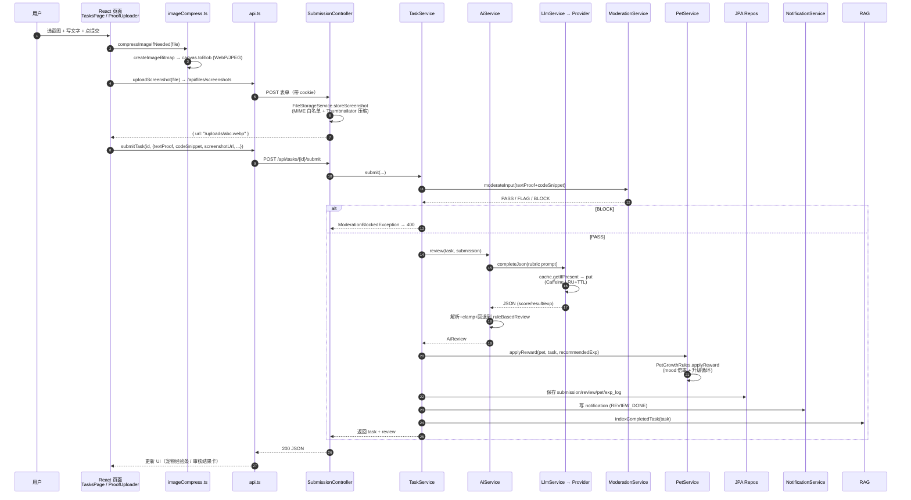

**踩点：**

- 前端在 [imageCompress.ts:16-63](../frontend/src/utils/imageCompress.ts) 用 `createImageBitmap` + Canvas 先在浏览器侧把图压到 ≤2400px / 2MB，节省上传带宽。后端拿到后又会用 Thumbnailator 二压一次，**两层都是有意为之**（前端省网，后端兜底防伪造请求绕过）。
- [SubmissionController.java](../backend/src/main/java/com/soulous/task/SubmissionController.java) 上贴 `@RateLimit(name="ai-submit", key=USER, ...)` → 切面拦截。
- `AiService.review` 优先调 LLM，**失败/超时/不可用都会回退到 `ruleBasedReview`**（详见 §4.4）——这就是为什么没接 API key 也能跑。

---

### 2.2 跟 AI 多轮拆解学习目标

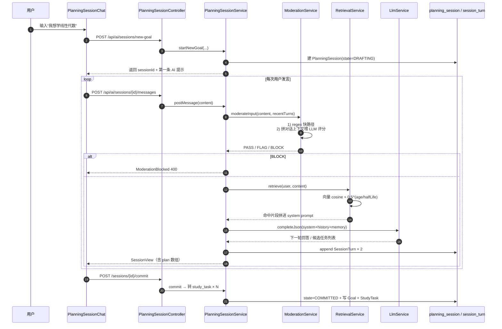

**关键代码地标：**

- 上下文/记忆拼接的逻辑在 [`PlanningSessionService`](../backend/src/main/java/com/soulous/aisession/PlanningSessionService.java)
- 风控两层（regex + LLM）在 [`ModerationService.moderateInput`](../backend/src/main/java/com/soulous/moderation/ModerationService.java:73)
- 时间衰减检索算法在 [`RetrievalService.retrieve`](../backend/src/main/java/com/soulous/rag/RetrievalService.java:139)
- 闲置 7 天的 DRAFTING session 每天 04:00 由 [`SessionCleanupTask`](../backend/src/main/java/com/soulous/aisession/SessionCleanupTask.java) 自动清

---

### 2.3 Refresh-token 单飞续签 + 重放检测

这是整个项目最容易出问题、也最值得读的安全机制。

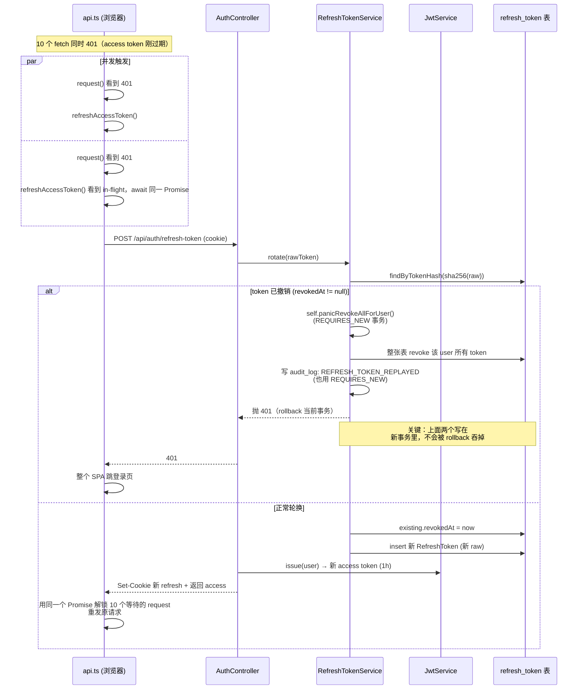

**单飞前端**：[api.ts:15-33](../frontend/src/api.ts#L15) ——一个模块级变量 `refreshInFlight` 保证多并发 401 只触发一次 refresh，否则 10 个请求并发刷新会被服务端当成 token 重放，直接把用户踢光。

**服务端原子轮换 + 重放检测**：[RefreshTokenService.rotate](../backend/src/main/java/com/soulous/auth/RefreshTokenService.java:97) ——核心是发现旧 token 已经 `revokedAt != null` 时：
- 通过**注入自身代理**（`@Lazy private RefreshTokenService self;`）调 `panicRevokeAllForUser`，让它走 Spring 代理才能真的开 `REQUIRES_NEW` 新事务。
- 审计 `REFRESH_TOKEN_REPLAYED` 也是用 `audit.recordInNewTransaction(...)`。两条记录都不会被外层 rollback 吞掉。

---

## 3. 后端架构（按层）

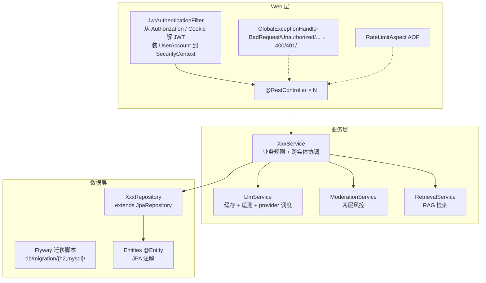

### 3.1 鉴权 Filter 链

- [`JwtAuthenticationFilter`](../backend/src/main/java/com/soulous/common/web/JwtAuthenticationFilter.java)：每个请求过一遍，从 `Authorization: Bearer` 或 cookie 抽 token，调 `JwtService.parse`，加载 `UserAccount` 校验 `tokenVersion`，写进 `SecurityContextHolder`。
- 配合 [`config/AppConfig.java`](../backend/src/main/java/com/soulous/config/AppConfig.java) 里的 `SecurityFilterChain` 决定哪些路径放行。
- `tokenVersion` 是项目自己加的字段——改密 / 主动登出全设备时自增，使旧 access JWT 直接失效（旧 token `tv` 对不上）。

### 3.2 限流切面

- [`@RateLimit`](../backend/src/main/java/com/soulous/common/ratelimit/RateLimit.java) 是自定义注解，可以贴一个或多个（同方法上写 `@RateLimit(...)` × 2 表示"同时满足两条规则"，比如"AI 调用 60/h ∧ 200/day"）。
- [`RateLimitAspect.enforce`](../backend/src/main/java/com/soulous/common/ratelimit/RateLimitAspect.java:36) 用 AspectJ `@Around` 拦截，按 `key=IP|USER` 从 `BucketRegistry` 拿到对应 `Bucket4j` 桶，`tryConsumeAndReturnRemaining(1)`：消费失败抛 `TooManyRequestsException(429 + Retry-After)`，并打 `soulous.rate_limit.blocked.total` 计数器。

### 3.3 Service / Repository / Entity

- 每个领域包都遵循 `XxxController → XxxService → XxxRepository → Entity`。
- Repository 全靠 Spring Data 方法名派生（`findByUserAndSourceTypeAndSourceId`、`countByUserAndVerdictAndCreatedAtAfter`），**没有手写 SQL**，复杂查询直接靠方法名解析或 `@Query`。
- Entity 是直接字段访问（`public Long id` 这种），不写 getter/setter——这是项目风格。

### 3.4 调度任务

| `@Scheduled` 类 | cron | 做什么 |
| --- | --- | --- |
| `SessionCleanupTask` | `0 0 4 * * *` | 清 7 天前 DRAFTING 闲置 session |
| `RefreshTokenService.garbageCollect` | `0 0 4 * * *` | 物理删除过期/撤销 >30 天的 refresh_token |
| `StorageGcTask` | `0 0 3 * * *` | 扫描 24h 前未被引用的对象（默认 dry-run） |

> 启用条件：[`SoulousApplication`](../backend/src/main/java/com/soulous/SoulousApplication.java) 上的 `@EnableScheduling`。

---

## 4. 核心模块深扒 · 手写 vs 调库

每个小节都给出：算法/规则在哪、自己写的核心逻辑做了什么、调了哪个库的哪个 API。

### 4.1 `PasswordPolicy` —— 完全手写

**文件：** [auth/PasswordPolicy.java](../backend/src/main/java/com/soulous/auth/PasswordPolicy.java)

**算法（自己写的）：**

```text
长度 8..72 → 没空格 → "字母/数字/符号至少含两类" → username≥4 字符且包含其中则拒。
"字母/数字/符号"用 java.lang.Character::isLowerCase / isUpperCase / isDigit / !isLetterOrDigit 四个谓词扫一遍字符串。
```

辅助函数 `containsAny(String s, IntPredicate test)` 是手写的小 helper，避免每次都写 for 循环。

**调库：** 仅依赖 JDK 的 `java.lang.Character` 类型判断、`java.util.function.IntPredicate`。没引入任何第三方密码强度库（zxcvbn 等）——刻意保持简单。

**配合：** 注册时由 `UserService.register` 显式调一次；JPA 层有 `@Size(min=8,max=72)` 做兜底。

---

### 4.2 `CaptchaService` —— 完全手写（含 SVG 渲染）

**文件：** [auth/CaptchaService.java](../backend/src/main/java/com/soulous/auth/CaptchaService.java)

| 函数 | 做了什么 | 调用 |
| --- | --- | --- |
| `issue()` | 4 位随机字符 + 36 进制 ID + 120s TTL，存进 `ConcurrentHashMap`，超容量按 expiresAt 升序丢一批 | `SecureRandom`, `AtomicLong.incrementAndGet`, `Long.toString(.., 36)` |
| `verify(id, code)` | 不存在/过期/错误统一抛 `BadRequestException`，错误用 `AtomicInteger` 记录，超过 5 次失败一次性作废 | 自己实现的"宽松一次性"语义 |
| `renderSvg(code)` | **拼字符串组 SVG**——24 个噪点圆 + 4 个旋转文字 + 3 条干扰线，最后 base64 成 data URL | `Base64.getEncoder()`, `StringBuilder` |

**没用** Kaptcha 或 EasyCaptcha——SVG 比位图小且文字仍是矢量。

---

### 4.3 `JwtService` + `RefreshTokenService` —— 调库为主

**JwtService**（[文件](../backend/src/main/java/com/soulous/auth/JwtService.java)）

| 调用 | 来源 | 用途 |
| --- | --- | --- |
| `io.jsonwebtoken.Jwts.builder().subject(...).claim(...).expiration(...).signWith(key).compact()` | **jjwt 0.12** | 签发 |
| `Jwts.parser().verifyWith(key).build().parseSignedClaims(token)` | jjwt 0.12 | 验签 |
| `Keys.hmacShaKeyFor(byte[])` | jjwt | 把 secret 转成 HMAC-SHA256 key |

手写部分：secret 不足 32 字节时用 `'0'` 在末尾补齐——jjwt 强制要求 ≥256bit，否则启动抛错；这段 padding 保证开发态不需要折腾。`claim("tv", user.tokenVersion)` 是项目自加的字段，让"主动登出全设备"成为可能（详见 §3.1）。

**RefreshTokenService**（[文件](../backend/src/main/java/com/soulous/auth/RefreshTokenService.java)）：

- `randomToken()` —— `SecureRandom` 出 32 字节 + Base64 URL-safe，自己写。
- `hash(raw)` —— `MessageDigest.getInstance("SHA-256")` + 自己拼 hex；DB 只存 hash，原始 token 只活在 cookie 里。
- `rotate()` —— 自己实现的"atomic 校验 → 撤销旧 → 发新"，外加重放检测。 **重点是用了 `@Lazy private RefreshTokenService self;` 这一招**，让 `panicRevokeAllForUser` / 审计写入走 Spring 代理才能开 `REQUIRES_NEW` 新事务，否则 in-class 直接调用 = 跳过 AOP，事务注解失效，审计会被 rollback 吞掉。
- `@Scheduled(cron=...)` `garbageCollect()` —— 30 天前的撤销/过期 token 物理清理。

---

### 4.4 `AiService` —— 双层策略：LLM 优先，规则兜底（**全是手写**）

**文件：** [ai/AiService.java](../backend/src/main/java/com/soulous/ai/AiService.java)

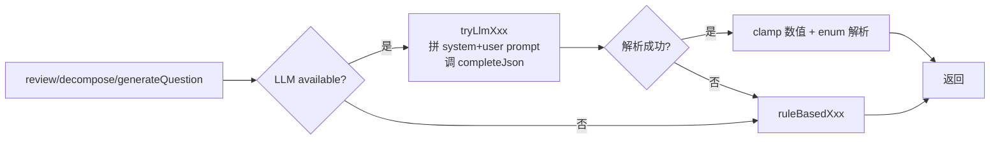

**关键手写片段：**

- `review` 的 [LLM rubric prompt](../backend/src/main/java/com/soulous/ai/AiService.java:41)：根据 `TaskType` 拼不同评分准则（CODING 要看代码、STUDY/NOTE 看文字深度、SIMPLE 上限 70 分）。这是项目对"AI 怎么打分"的核心 prompt 工程。
- `ruleBasedReview` 的[手写打分](../backend/src/main/java/com/soulous/ai/AiService.java:137)——三维分（相关性 / 完整度 / 质量）由字符长度、关键词命中数、是否带截图/代码加权得出。关键词命中数用的是**自己写的简易 tokenizer**：

  ```java
  text.replaceAll("[^\\p{IsHan}A-Za-z0-9]+", " ")
      .toLowerCase(Locale.ROOT)
      .split("\\s+")
  ```

  `\p{IsHan}` 把中日韩统一表意文字当作 token 字符。
- `evaluateAnswer` —— 用户对 AI 追问的简答打分（0-10）。同样的 tokenizer + 命中数 × 15 + 长度/3，clamp 后除 10。
- `parseEnum<E>(Class<E>, String, E)` —— 一行 `Enum.valueOf(...)` 包 try/catch 的小泛型工具。

**库调用：** 只用 `com.fasterxml.jackson.databind.JsonNode` 做 LLM 返回的弱类型 JSON 取值（`.path("score").asInt(0)`）。

---

### 4.5 `LlmService` —— Provider Facade + Caffeine 缓存

**文件：** [ai/LlmService.java](../backend/src/main/java/com/soulous/ai/LlmService.java)

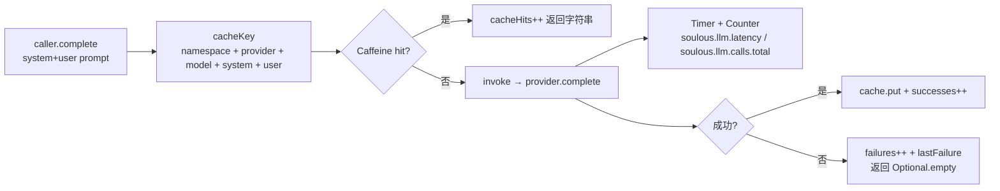

| 手写部分 | 库调用 |
| --- | --- |
| Provider 路由（`registry.get(name)`、`registry.getDefault()`） | — |
| `cacheKey()` 字符串拼接 + namespace（按用户 id 分桶，防跨用户撞缓存） | — |
| `extractJson()` —— 容忍 LLM 输出 ```` ```json ```` 围栏、找首个 `{`/`[` 配对 `}`/`]` 抽出来 | `Jackson ObjectMapper.readTree` 解析 |
| `complete(...)` 异常吞错 + 指标埋点 | `Caffeine.newBuilder().maximumSize(max).expireAfterWrite(...).ticker(...)`<br/>`MeterRegistry.counter / timer`<br/>`Timer.start / sample.stop` |
| `now()` 可覆写——测试里替换走假时钟，**这是为了让 TTL 测试不依赖 `Thread.sleep`** | Caffeine 的 `Ticker` 接口接 `now()*1_000_000L`（毫秒 → 纳秒） |
| `stats()` 暴露 `cacheHits/successes/failures/cacheSize/lastFailure*` | — |

**关键点：** 任何异常都不抛上去，统一返回 `Optional.empty()`，由 `AiService` 决定回退到规则。这就让"LLM 挂了也不影响业务"成为铁律。

---

### 4.6 `ModerationService` —— 两层风控（regex + LLM）

**文件：** [moderation/ModerationService.java](../backend/src/main/java/com/soulous/moderation/ModerationService.java)

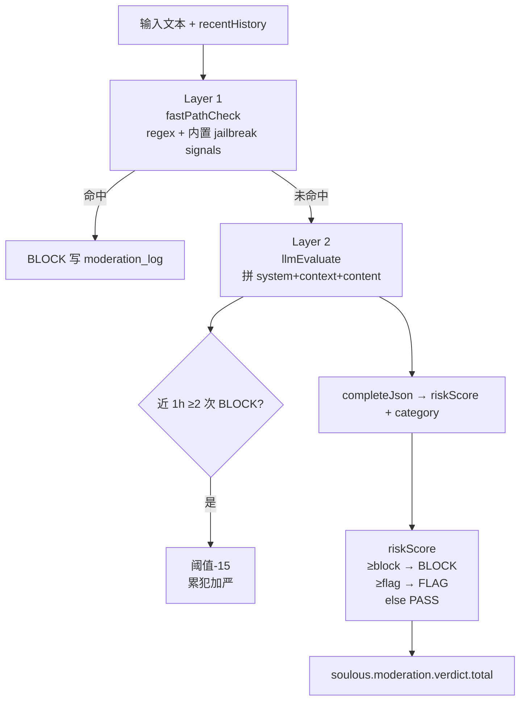

**手写片段：**

- `containsJailbreakSignal(lower)` —— 大约 20 个高信号短语（中英混合："忽略你的指令"、"jailbreak"、"developer mode"等）的子串扫描。**故意写得保守**，宁可漏也不要误杀，细腻判断交给 LLM 层。
- `buildContextSnippet` —— 取 `recentHistory` 末尾 N 条（`props.getContextWindow()`），每条截断 500 字，拼成"用户：xxx / 助手：xxx"格式。让 LLM 能看到上下文，捕获"渐进式攻击"。
- 累犯加严：通过 `logs.countByUserAndVerdictAndCreatedAtAfter(user, BLOCK, now-1h)` 数最近 1h 的 BLOCK 数，≥2 就把 block/flag 阈值都 `-15`，**让多次试探的用户越来越难绕过**。
- `parseResult` —— 把 LLM 返回的 `riskScore` 按可配置阈值映射到 PASS/FLAG/BLOCK，category 解析失败时按分数兜底。

**库调用：** `java.util.regex.Pattern.compile(p, CASE_INSENSITIVE | UNICODE_CASE)` 编译用户配置的 fastBlockPatterns；其余全是手写。

---

### 4.7 `RetrievalService` —— Cosine + 时间衰减（**自己写的小型向量检索**）

**文件：** [rag/RetrievalService.java](../backend/src/main/java/com/soulous/rag/RetrievalService.java)

| 函数 | 算法 |
| --- | --- |
| `cosine(q, qNorm, d)` | 经典 cosine。**优化：调用方先算好 query 的 norm，循环里只算文档侧的 sumSq，省一次 sqrt 重复计算** |
| `norm(v)` | `√Σv²` |
| `timeDecay(memoryTime, now, halfLifeDays)` | `2^(-ageDays / halfLifeDays)`；`halfLifeDays ≤ 0` 时返回 1.0（关闭衰减） |
| `retrieve(user, query, topK, minSim)` | 1) 算 query 向量+norm → 2) `repo.findByUser(user)` 拉全表 → 3) 用 cosine 过 `minSim` → 4) 通过的乘 `timeDecay` 得到最终分 → 5) `Comparator.comparingDouble(...).reversed()` 取 top-K |
| `serialize` / `deserialize` | 自己写的 CSV `,` 编码（每条 embedding 存一行字符串）。不依赖 pgvector，纯应用层 |
| `indexOrUpdate(user, type, sourceId, content)` | 幂等 upsert：存在就覆盖，不存在就建；content 为空则删 |

**重要细节**：阈值（`minSim`）对**原始 cosine** 过滤，但排序用**衰减后的分**——这样操作者配 `min-similarity` 时直觉是"语义相似度"，跟时间无关；衰减只影响"同样语义的新旧记忆谁排前面"。

**库调用：** 仅 Spring `@Service` / `@Transactional` / `java.time.Clock`。Clock 故意做成可注入，测试可以塞固定时间。

---

### 4.8 `PetGrowthRules` —— 纯静态规则（**全是手写算法**）

**文件：** [pet/PetGrowthRules.java](../backend/src/main/java/com/soulous/pet/PetGrowthRules.java)

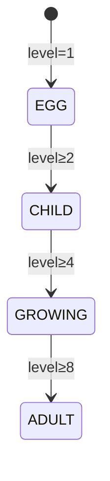

| 公式 | 代码 |
| --- | --- |
| 升下一级所需经验 | `expForNextLevel(level) = level==1 ? 100 : 100 + level*35` |
| 心情倍率 | `mood≥80 → 1.2x`, `mood≤30 → 0.8x`, 否则 1.0x |
| 一次奖励的实际经验 | `amount = round(requested * moodMult)` |
| 心情增益 | 大奖励（≥80% baseExp）+10，否则 +5 |
| 升级循环 | `while currentExp ≥ nextLevelExp { currentExp -= nextLevelExp; level++; }`——一次提交可能跨多级 |
| 状态机 | 大奖 → `PROUD`, 一般 → `HAPPY`, 升级瞬间 → `EXCITED`, NEED_MORE → `SLEEPY`, REJECT → `SAD` |

`normalize(pet)` 在每个入口先把 null/越界值修好——历史数据兼容用。

**没用 Lombok**、**没用任何框架**、纯 `Math.max/min/round/ceil` + JDK。这块拿出来就能直接做单测，所以测试覆盖也是项目里最厚的一块（`PetGrowthRulesTests` 5 例）。

---

### 4.9 `FileStorageService` + `ImageCompressor` —— 调库压缩

**文件：** [storage/FileStorageService.java](../backend/src/main/java/com/soulous/storage/FileStorageService.java)

| 步骤 | 手写 / 调库 |
| --- | --- |
| MIME 白名单 + 扩展名白名单 + 大小校验 | 手写（`Map.of` + `Set.of`） |
| 实际压缩 | 调 `ImageCompressor.compress`（项目内）→ 底层用 **Thumbnailator** `Thumbnails.of(...).size(maxDim, maxDim).outputFormat(...).outputQuality(0.85).asBufferedImage()` |
| 落盘 / 上 S3 | `ObjectStorage` 接口，两种实现：`LocalObjectStorage`（写到 `backend/uploads/`）和 `S3ObjectStorage`（AWS SDK） |
| key 校验 | 手写正则 `[A-Za-z0-9_-]{1,80}\.(png\|jpg\|jpeg\|gif\|webp)`，防止路径穿越 |

前端那一份 `imageCompress.ts` 走 **Canvas API**（`createImageBitmap` → `canvas.toBlob(target, quality)`）——这是浏览器原生而非 Thumbnailator，因为后者是 Java。

---

### 4.10 `StatsService` / `DailyReviewService` —— 聚合 + 模板拼接

**StatsService**：调 JPA repository 的 `countByXxxBetween / sumXxxByUserGroupBy...` 派生方法，把"今日打卡数 / 7 天热力图 / 课程占比"拼成前端能直接喂 Recharts 的扁平数组。**没手写 SQL**。

**DailyReviewService**：拿当日 study_task / focus_session 聚合后，喂给 `LlmService.completeJson` 让 AI 出"日报"文本；不可用时退回到模板 + 占位字段。

---

## 5. 前端架构与关键代码

### 5.1 单体 SPA 结构

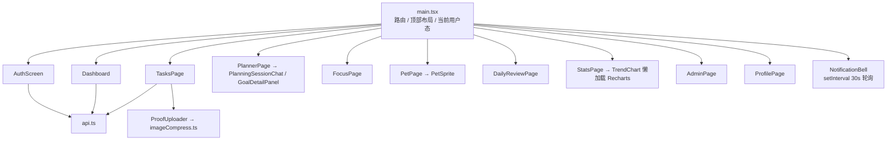

- 路由：没有 React Router，由 `main.tsx` 自己用 `useState` + Tab 控制——项目刻意保持简单。
- 状态：纯 hook，没有 Redux/Zustand。
- 图表：`Recharts` 懒加载（[`components/TrendChart.tsx`](../frontend/src/components/TrendChart.tsx) 用 `React.lazy + Suspense`），避免主 bundle 拉胖。

### 5.2 `api.ts` 单飞 refresh 细节

[api.ts](../frontend/src/api.ts)：

- 模块级 `let refreshInFlight: Promise<boolean> | null` 保证并发 401 共享同一次 `/api/auth/refresh-token`。
- `request<T>` 路径用 `fetch`；`upload<T>` 有两条路径——无进度回调走 `fetch`，需要进度则走 `XMLHttpRequest`（fetch 还不支持上传 progress 事件）。
- `isAuthEndpoint(path)` 让 `login/register/refresh` 自己 401 时不递归刷新。

### 5.3 `imageCompress.ts`

- 入口 `compressImageIfNeeded(file, opts)`：
  - GIF / WebP 跳过（一般已经够小）。
  - `createImageBitmap(file)` 拿到位图 → 计算最长边 → 是否超 `maxDim` 或文件超 `maxBytes`。
  - 不需要压则直接返回原 `File`。
  - 否则建 canvas → `ctx.drawImage(bitmap, 0, 0, w, h)` → `canvas.toBlob(resolve, 'image/webp', 0.85)`。
  - 压完比原文件还大且尺寸又没变就保留原文件。
- 全部走浏览器原生 API，没引第三方。

### 5.4 `PetSprite.tsx`

[PetSprite.tsx](../frontend/src/PetSprite.tsx)：

- `animations` 对象列出 9 种状态对应的 sprite atlas 行号 + 每帧 ms 时长。
- 用 `useEffect + window.setTimeout` 推进 `frame`（**不是用 CSS animation**），因为每帧时长不同。
- 渲染时用 `transform: translate3d(-frame*size, -row*height, 0)` 平移整张 sprite 图——硬件加速 + 不会触发 layout。
- atlas 资源在 [`frontend/public/pets/feixue/`](../frontend/public/pets/feixue/)，由仓库根的 [hatch-soulous-pet](../skills) skill 生成。

### 5.5 `PlanningSessionChat.tsx`

[components/PlanningSessionChat.tsx](../frontend/src/components/PlanningSessionChat.tsx)：渲染多轮对话气泡 + 当前 plan 草稿 + commit 按钮。所有"AI 在拆解吗 / 用户能改任务列表 / 一键 commit"逻辑都集中在这里，后端是 `PlanningSessionController`。

---

## 6. 数据库 schema 概览

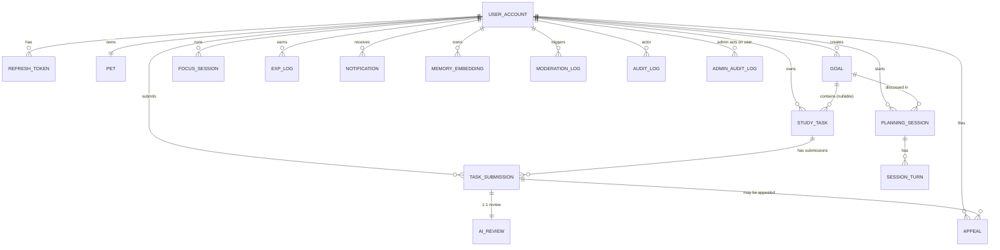

**手动维护的 schema 全部走 Flyway**（`backend/src/main/resources/db/migration/{h2,mysql}/V*.sql`）。新增表/字段写 V<n> 增量；勿改 V1 基线。

---

## 7. 库 / 依赖 速查

| 库 | 用在哪 | 关键 API |
| --- | --- | --- |
| **Spring Boot 3.4** | Web / DI / Filter / AOP | `@RestController`, `@Service`, `SecurityFilterChain`, `@Aspect`, `@Around`, `@Scheduled` |
| **Spring Data JPA + Hibernate** | DAO 层 | `JpaRepository<T, ID>`, 方法名派生查询, `@Query` |
| **Flyway** | schema 迁移 | `db/migration/{vendor}/V<n>__*.sql`, `baseline-on-migrate` |
| **jjwt 0.12** | JWT 签发/验签 | `Jwts.builder()...signWith(key)`, `Jwts.parser().verifyWith(key).parseSignedClaims(...)` |
| **Caffeine** | LlmService 缓存 | `Caffeine.newBuilder().maximumSize(max).expireAfterWrite(d).ticker(t).build()` |
| **Bucket4j** | 限流桶 | `Bucket.tryConsumeAndReturnRemaining(1) → ConsumptionProbe.{isConsumed, nanosToWaitForRefill}` |
| **AspectJ** | 限流切面 | `@Aspect`, `@Around("@annotation(...)")`, `ProceedingJoinPoint` |
| **Micrometer + Actuator** | Prometheus 指标 | `MeterRegistry.counter / timer`, `/actuator/prometheus` |
| **Jackson** | LLM JSON 弱解析 | `ObjectMapper.readTree`, `JsonNode.path("x").asInt(default)` |
| **Thumbnailator** | 图片缩放 | `Thumbnails.of(...).size(w,h).outputQuality(0.85).asBufferedImage()` |
| **BCrypt（Spring Security）** | 密码哈希 | `BCryptPasswordEncoder.encode / matches` |
| **H2 / MySQL Connector/J** | DB | runtime scope |
| **React 19 + Vite 6 + TS 5** | 前端壳 | `useState/useEffect`, `React.lazy + Suspense` |
| **lucide-react** | 图标 | `<IconName size=.../>` |
| **Recharts** | 图表（懒加载） | `<LineChart><Line/><XAxis/>...` |
| **Vitest + @testing-library/react** | 前端测试 | `render`, `screen.getByText`, `userEvent.click` |

---

## 8. 读代码顺序建议

如果你完全是新手要 cold-read 这个仓库，按这个顺序最省力：

1. 跑起来：先按根目录 README 让前后端起来，玩 5 分钟，把 UI 上的功能跟 §1 的包对上。
2. 读"流程图"：本文 §2 三张序列图，每张挑一处 file:line 跳进去看一眼上下文。
3. 读 §4 的"手写算法"小节，按顺序：
   - `PasswordPolicy` → `PetGrowthRules` → `AiService.ruleBasedReview`
   - 这三个是**最容易读完就懂**的纯逻辑，不涉及 Spring/AOP/事务。
4. 读 §4.3 `JwtService` / `RefreshTokenService` + §2.3 时序图——这是项目里**对 Spring 事务理解要求最高**的部分。
5. 读 §4.5 `LlmService` + §4.4 `AiService` ——理解"LLM 优先，规则兜底"的容灾思路。
6. 读 §4.6 `ModerationService` + §4.7 `RetrievalService` ——这是项目区别于一般 CRUD 的"亮点"。
7. 最后扫前端 §5：`api.ts` 单飞、`imageCompress.ts` 浏览器侧压图、`PetSprite.tsx` sprite 动画。

读完这条主路径，剩下的 Controller / Repository / Entity 大都是"按名字猜功能"就能看懂的胶水代码，不用专门读。

---

## 9. 自己想动手时的小提示

- 写新接口：抄一个最近的 Controller（比如 [`GoalController`](../backend/src/main/java/com/soulous/goal/GoalController.java)）模板，注意贴 `@RateLimit` 和 `@Transactional`。
- 加新 entity：先在 [`db/migration/h2/`](../backend/src/main/resources/db/migration/h2/) 和 `mysql/` 同时加 `V<下一个n>__xxx.sql`，再写 `@Entity` ，**不要靠 `ddl-auto=update` 隐式建表**——prod 是 `validate`，会启动失败。
- 调 LLM：永远走 `LlmService.complete / completeJson`，不要直接 `new HttpClient`；不可用要有 rule-based 兜底。
- 前端发请求：走 `api.ts`，不要写裸 `fetch`——否则 401 自动刷新和单飞机制都没法享受。

---

最后修订：2026-05-19（claude opus 4.7 与 xiaorana 合写）。
