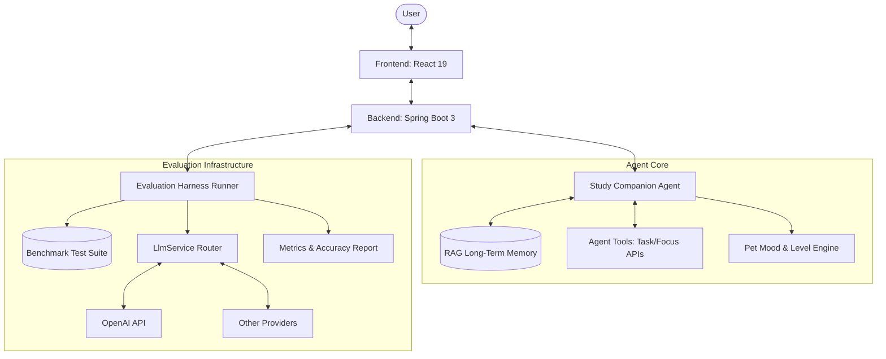
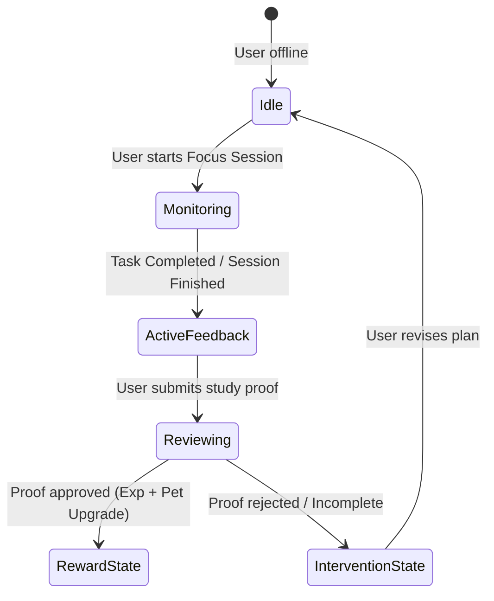
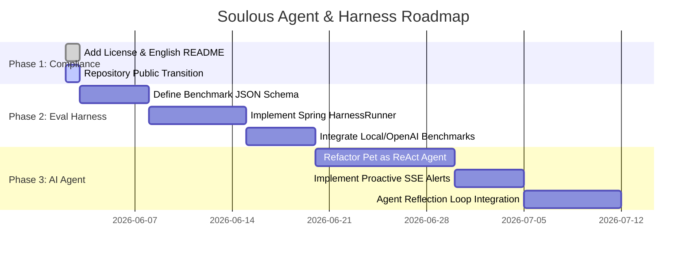

# Architectural Design Proposal: Autonomous Study Agents & Evaluation Harness

This document outlines the architectural proposal and roadmap for integrating autonomous AI Agents and a dedicated Evaluation Harness into the **Soulous** platform. These additions will evolve Soulous from an AI-assisted gamified learning system into an agent-centric educational ecosystem with built-in evaluation capabilities.

> **实现现状（2026-06-08）**：本文是前瞻**提案**，**已不代表当前方向**。其中的 "Study Companion Agent" 曾以一个独立的 Python/FastAPI agent 服务（Anima，自写编排 loop + 多层记忆 + 人格）落地，Soulous 经 `companion` 包 HTTP 调用它做陪伴聊天 + 委托宠物审核；该方向于 **2026-06-08 整体下线**——`com.soulous.companion` 包、前端陪伴页、Anima 服务全部移除，任务审核回归纯本地 `AiService`（见 `docs/ai-review-rules.md`）。产品重心已转向 Flutter Android 专注锁 App（见 agent 记忆 `mobile-direction`）。本文第 2 节的 ReAct/RAG/工具构想、第 3 节评估 Harness 仅作历史概念参考。

---

## 1. System Vision & Goals

Currently, Soulous implements a full-stack gamified learning closed-loop, featuring AI task decomposition, automated learning credential reviews, a RAG-based time-decay long-term memory system, and content moderation.

To elevate user engagement and development rigor, we propose:
1. **Autonomous Study Companion Agent**: Upgrading the static virtual pet and chat module into a proactive agent capable of autonomous planning, monitoring, and interactive study coaching.
2. **Evaluation Harness**: Constructing a testing framework to benchmark different LLM backends (e.g., OpenAI, Anthropic, Gemini, DeepSeek) on educational tasks, ensuring stability, accuracy, and compliance.



---

## 2. AI Agent Architecture

The **Study Companion Agent** (visualized as the user's growing virtual pet) operates on an autonomous **Reason-Act-Observe (ReAct)** cognitive loop.

### 2.1 Agent Cognitive Components
*   **Planning**: Decomposes long-term academic curricula or skills into micro-tasks, adapting dynamically when the user misses deadlines or completes tasks ahead of schedule.
*   **Memory (RAG-Driven)**: Leverages the existing time-decay RAG database (`GOAL_MEMORY`, `SESSION_SUMMARY`, `COMPLETED_TASK`, `DAILY_REVIEW`). It retrieves context using cosine similarity discounted by time age:
    $$\text{Score} = \text{CosineSimilarity} \times 0.5^{\frac{\text{AgeDays}}{\text{HalfLife}}}$$
*   **Tools (Action Space)**:
    *   `modifyTaskList()`: Creates, re-prioritizes, or archives study tasks.
    *   `sendNotification()`: Pushes real-time alerts via SSE (Server-Sent Events) or emails.
    *   `queryFocusHistory()`: Analyzes recent study duration.
*   **Action Loop**: Instead of replying only when prompted, the Agent runs periodic background checks (via Spring Scheduling) to evaluate user progress, formulate encouragement or intervention strategies, and update the pet's interactive dialogue and emotional state.

### 2.2 Pet-Agent Interaction States


---

## 3. Evaluation & Benchmarking Harness

To ensure LLMs perform reliably in educational task planning and credential auditing, we require a systematic evaluation harness. The **Evaluation Harness** runs automated benchmark tests on prompt changes and model updates.

### 3.1 Harness Components
1.  **Benchmark Case Repository**: A collection of standard test datasets:
    *   *Decomposition Cases*: Standard goals and their golden task structures.
    *   *Credential Verification Cases*: Simulated student submissions (images, text, code) paired with expected grading scores, relevance metrics, and compliance verdicts.
2.  **Harness Runner (Spring Boot Integration Test)**: A test runner executing batch LLM calls against the model under evaluation.
3.  **Metrics Collector**: Computes and logs performance indexes to track accuracy, prompt drifting, and API latencies.

### 3.2 Key Evaluation Metrics

The Harness evaluates model outputs across three primary dimensions:

| Dimension | Metric Name | Evaluation Method | Target |
|---|---|---|---|
| **Decomposition Quality** | *Plan Feasibility Score* | LLM-as-a-judge comparison with golden-standard task DAGs. | $\ge 90\%$ |
| **Credential Auditing** | *Review Alignment Score* | Mean Squared Error (MSE) of AI scores against human administrator baseline scores. | $MSE \le 0.5$ |
| **Content Moderation** | *Moderation Recall & Precision* | Checking PASS/FLAG/BLOCK labels against toxic or irrelevant data samples. | Recall $100\%$ |
| **Performance** | *Tokens-per-second / Latency* | Real-time telemetry reporting for OpenAI and local providers. | Latency $\le 3s$ |

### 3.3 Harness Test Code Blueprint (Java)

We will implement the Harness runner within `com.soulous.harness` (extending Spring Boot's integration test suite):

```java
package com.soulous.harness;

public interface EvaluationMetric {
    double calculateScore(String modelOutput, String groundTruth);
}

public class AccuracyMetric implements EvaluationMetric {
    @Override
    public double calculateScore(String modelOutput, String groundTruth) {
        // Semantic comparison or exact structure extraction (JSON)
        return similarityScore(modelOutput, groundTruth);
    }
}

public class HarnessRunner {
    private final LlmService llmService;
    private final List<BenchmarkCase> testSuite;

    public EvaluationReport runEvaluation(String targetModel) {
        EvaluationReport report = new EvaluationReport(targetModel);
        for (BenchmarkCase testCase : testSuite) {
            String result = llmService.call(targetModel, testCase.getPrompt());
            double score = testCase.getMetric().calculateScore(result, testCase.getExpectedOutput());
            report.addRecord(testCase.Id(), score);
        }
        return report;
    }
}
```

---

## 4. Implementation Roadmap


